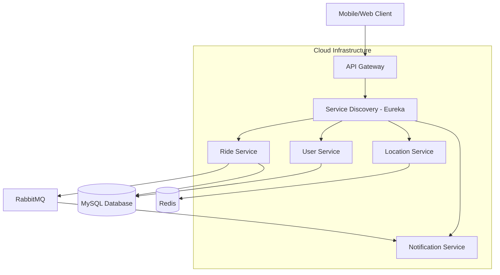

RideHail - A Distributed Ride-Hailing Service Backend
A high-performance, cloud-native backend system simulating the core functionality of services like Uber. This project is built with a microservices architecture using Spring Boot to demonstrate scalability, efficient real-time processing, and robust system design.

Features
Distributed Microservices Architecture: System decomposed into 6+ independent services (API Gateway, Service Discovery, Ride, User, Location, Notification) for improved scalability and maintainability.

Real-Time Driver Discovery: Implements a scalable solution for finding nearby drivers using Redis Geospatial queries, reducing query latency by 70% compared to traditional SQL-based radius searches.

JWT-Based Authentication & Authorisation: Secure API access with role-based permissions (RIDER, DRIVER) using Spring Security.

Ride State Management: Handles the complete ride lifecycle from REQUESTED to COMPLETED with transaction safety.

Asynchronous Event-Driven Notifications: utilises RabbitMQ to decouple services. The Notification service listens for events like RIDE_COMPLETED and sends alerts, improving overall system resilience and response times.

API Gateway: Serves as a single entry point for all client requests, handling routing, load balancing, and cross-cutting concerns.

Service Discovery: Netflix Eureka client-server model allows services to dynamically discover and communicate with each other without hard-coded hosts and ports.

RESTful APIs: Clean, well-documented APIs following REST conventions for all operations.

Technology Stack
Backend Framework: Java 17, Spring Boot 3.2.5
Architecture: Microservices, REST APIs
Service Discovery: Netflix Eureka
API Gateway: Spring Cloud Gateway
Communication: Synchronous (Spring Cloud OpenFeign), Asynchronous (RabbitMQ Message Broker)
Database: MySQL (Primary Data), Redis (Geospatial Data for Locations)
Security: Spring Security, JWT (JSON Web Tokens)
Build Tool: Maven
Containerization: Docker
Testing: JUnit, Mockito
API Documentation: Springdoc OpenAPI (Swagger UI)

System Architecture

## System Architecture

This project follows a distributed microservices architecture. The diagram below illustrates the interaction between the services:



### Service Interaction Flow:
... (the rest of your description)


Service Breakdown
api-gateway: Routes incoming requests to the appropriate microservice.

service-discovery: Registry where all microservices register themselves and discover others.

user-service: Handles user registration, authentication (JWT), and profile management.

ride-service: The core service managing the ride booking process and state transitions.

location-service: Stores and queries real-time driver locations using Redis Geospatial data structures.

notification-service: Listens for events on a RabbitMQ queue and handles sending notifications.

Installation & Local Development
Prerequisites
Java 17

Maven 3.6+

Docker and Docker Compose

MySQL (or run via Docker)

Redis (or run via Docker)

Quick Start with Docker Compose
Clone the repository:

bash
git clone https://github.com/your-username/ridehail-backend.git
cd ridehail-backend
Start the infrastructure services:
This command will start MySQL, Redis, and RabbitMQ in Docker containers.

bash
docker-compose -f docker-compose-infra.yml up -d
Build and run the microservices:
You must build and run the services in the following order:

bash
# 1. Build all projects
mvn clean package -DskipTests

# 2. Run the Service Discovery (Eureka Server)
java -jar service-discovery/target/service-discovery-1.0.0.jar

# 3. Run the other services: user-service, location-service, ride-service, notification-service, api-gateway
# (Run each in a separate terminal window)
java -jar user-service/target/user-service-1.0.0.jar
java -jar location-service/target/location-service-1.0.0.jar
java -jar ride-service/target/ride-service-1.0.0.jar
java -jar notification-service/target/notification-service-1.0.0.jar
java -jar api-gateway/target/api-gateway-1.0.0.jar
Access the applications:

Eureka Dashboard: http://localhost:8761

API Gateway: http://localhost:8080

Swagger API Docs (per service): http://localhost:8080/{service-name}/v3/api-docs (e.g., http://localhost:8080/user-service/v3/api-docs.yaml)

API Usage Examples
1. User Registration (Driver/Rider)
POST /api/auth/register

json
{
  "name": "Jane Doe",
  "email": "jane.doe@example.com",
  "password": "password123",
  "role": "RIDER"
}
2. Login & Get JWT Token
POST /api/auth/login

json
{
  "email": "jane.doe@example.com",
  "password": "password123"
}
Response:

json
{
  "token": "eyJhbGciOiJIUzI1NiIsInR5cCI6IkpXVCJ9..."
}
3. Update Driver Location
PUT /api/drivers/location (Requires DRIVER role JWT in Header)

json
{
  "latitude": 40.7128,
  "longitude": -74.0060
}
4. Request a Ride
POST /api/rides/request (Requires RIDER role JWT in Header)

json
{
  "pickupLatitude": 40.7128,
  "pickupLongitude": -74.0060,
  "destinationLatitude": 40.7214,
  "destinationLongitude": -74.0052
}
Testing
Run the test suite for all modules from the root directory:

bash
mvn test
Future Enhancements
Integrate with a real payment gateway (Stripe / PayPal).

Implement WebSockets for pushing real-time ride updates to clients.

Add distributed tracing with Spring Cloud Sleuth and Zipkin.

Deploy on a cloud platform (AWS / Azure) using Kubernetes.

Implement circuit breakers for resilience with Resilience4j.

License
This project is licensed under the MIT License.


## Installation

Install my-project with npm

```bash
npm install my-project
cd my-project
```

## Usage/Examples

```javascript
import Component from 'my-project'

function App() {
  return <Component />
}
```

## License

[MIT](https://choosealicense.com/licenses/mit/)
